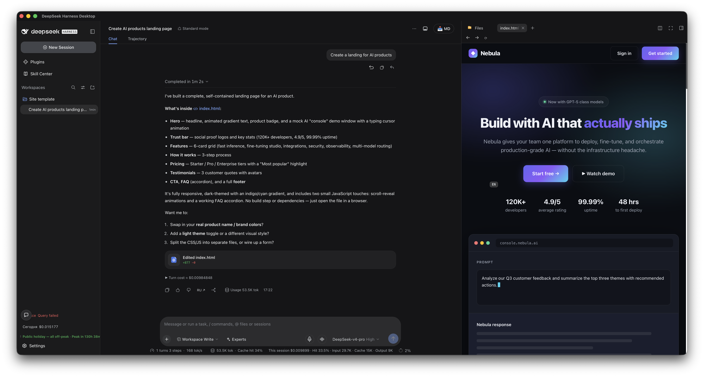

# dsh-side-html-viewer

A [DSH](https://github.com/deepseek-ai/dsh) plugin that renders HTML files from
the Files sidebar in a **real browser iframe** — with working CSS, JavaScript,
ES modules, and same-origin `fetch`, instead of a static preview.



An HTML landing page opened from the Files sidebar, rendered in the browser
panel alongside the chat.

## Features

- Serves `.html` / `.htm` files from a session's workspace root over the
  `/browser-html/<sessionId>/<path>` route.
- Full iframe rendering: inline `<script type="module">`, `<link>` stylesheets,
  images, and local `fetch` of sibling files all work.
- Strict security model:
  - Requests are gated to trusted origins (loopback / configured `trustedHosts`).
  - Paths are confined to the session workspace root (`..`, UNC, and drive
    escapes are rejected, and a symlink resolving outside the root is refused
    via a `realpath` re-check).
  - Served with a restrictive CSP, `X-Content-Type-Options: nosniff`, and
    no-cache headers.
- Configurable media size limit (default 20 MiB).
- A browser toolbar (back / forward / reload) above the frame; reload is also
  bound to the framework's `refresh` command (Ctrl+R).
- Registers a `html-browser` tab type in the sidebar-right pane.

## Security model

The plugin renders workspace HTML on the **GUI's own origin in an unsandboxed
iframe**. This is a deliberate, accepted trade-off (see the design spec): it is
what makes inline scripts, ES modules, same-origin `fetch`, and storage work.
Consequently:

- The `/browser-html` route is a **request-provenance fence, not
  authentication**. Anything that can reach the loopback HTTP port passes; the
  fence only rejects cross-site requests (DNS rebinding / confused deputy) via
  `Host`, `Origin`, and Fetch Metadata checks.
- Any HTML file in a session workspace can therefore reach the GUI origin and,
  within it, read sibling files from **any** session's workspace (there is no
  per-session isolation between requests), and — through the trusted route —
  serve any regular file under a workspace root, not just `.html`. Treat HTML
  in a workspace as code you trust to run on the host account.
- External subresources (script/style/img/font/`fetch`) are blocked by CSP;
  external **navigation** is not, so clicking an external link loads that site
  in the iframe.

## Install

```bash
dsh plugin --profile <name> add dsh-side-html-viewer
```

Then restart the profile's server. Open any `.html` file from the Files sidebar
to see it rendered.

## Development

```bash
npm install
npm run build   # emits lib/index.js (host) + lib/client.js (client)
npm test        # vitest
```

The client bundle is built with `tsdown` as a CommonJS module wrapped in the
`window.__ModuleLoader__.load({...})` envelope expected by the DSH web client.
The banner/footer shim (`var module = { exports: {} }` / `return module.exports`)
is required — the loader invokes the factory with only `require` in scope.

## Layout

- `src/index.ts` — host entry (`apply`/`inject`/`name`), registers the
  `/browser-html` route.
- `src/handler.ts` — request handling (trust gate, path resolve, stat, serve).
- `src/client/*` — client entry (`tab.tsx`) registering the sidebar-right tab
  and iframe body.
- `cordis.patch.yml` — bundle layer inserting the plugin.

## License

MIT
